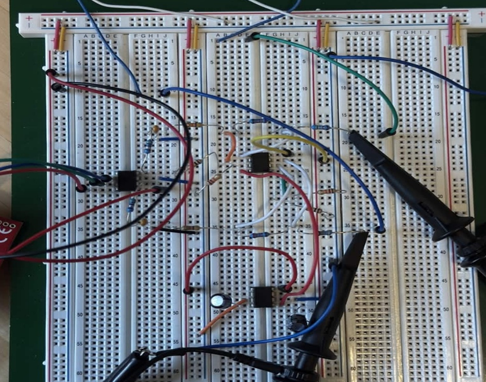
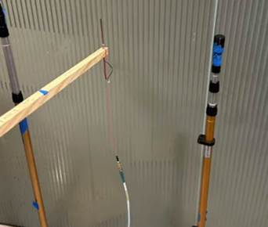
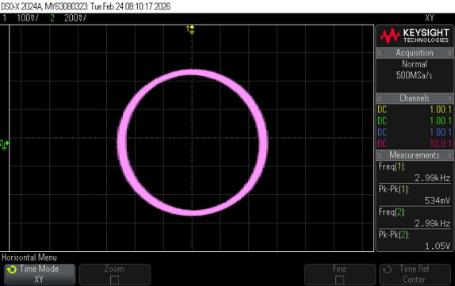
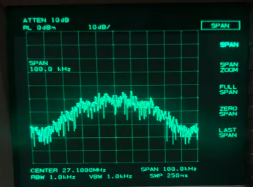
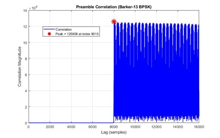
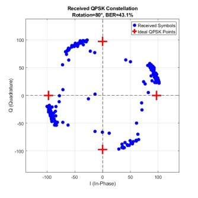

# Wireless Digital Communication System
**Technologies:** TM4C123 • Embedded C • MATLAB • RTL-SDR • RF Communications • Spectrum Analyzer • Oscilloscope

> University of Texas at Arlington | Wireless Communications Laboratory Project

Embedded wireless communication system featuring digital modulation, RF propagation, antenna testing, and MATLAB signal processing.

---

## Overview

The Wireless Digital Communication System project explores the complete communication chain of a modern digital wireless system, from signal generation and modulation to RF transmission, antenna characterization, signal reception, and digital demodulation.

Using embedded hardware, RF laboratory equipment, and MATLAB, the project demonstrates how digital information is transmitted through a wireless channel, affected by propagation and antenna characteristics, and successfully recovered at the receiver.

The project combines embedded systems, RF engineering, digital communications, signal processing, and experimental measurement techniques.

---

## Laboratory Demonstrations

### Embedded Hardware Setup

<p align="center">
  
</p>

*TM4C123GXL-based embedded hardware used for digital modulation and wireless communication experiments.*

### RF & Antenna Testing

<p align="center">
  
</p>

*Laboratory antenna configuration used for RF propagation and signal attenuation measurements.*

---

## Project Objectives

- Design and evaluate a digital wireless communication system.
- Generate digitally modulated RF signals.
- Analyze RF propagation and antenna performance.
- Investigate polarization and signal attenuation.
- Receive wireless signals using software-defined radio.
- Recover transmitted information through digital demodulation.
- Evaluate communication performance using experimental measurements.

---

## Project Workflow

```
Embedded Transmitter
        ↓
Digital Modulation
        ↓
DAC & RF Signal Generator
        ↓
Transmit Antenna
        ↓
Wireless Channel
        ↓
Receive Antenna
        ↓
RTL-SDR Receiver
        ↓
MATLAB Signal Processing
        ↓
Digital Demodulation
        ↓
Bit Error Analysis
```

---

## System Components

### Embedded Hardware

- TM4C123GXL LaunchPad
- Digital-to-Analog Converter (DAC)
- Operational Amplifier

### RF Equipment

- RF Signal Generator
- Spectrum Analyzer
- Oscilloscope
- RTL-SDR Receiver

### Antennas

- 2.4 GHz Yagi-Uda Antenna
- X-Band Horn Antenna
- 935 MHz Dipole Antenna

### Software

- Embedded C
- MATLAB

---

## Digital Modulation

The transmitter portion of the project focused on generating digitally modulated signals using embedded hardware and RF instrumentation.

Topics investigated included:

- IQ Modulation
- BPSK
- QPSK
- 8PSK
- 16-QAM
- Root Raised Cosine (RRC) Filtering

Experimental measurements were performed using oscilloscopes and spectrum analyzers to observe signal behavior and modulation quality.

### I/Q Signal Analysis

<p align="center">
  
</p>

*Oscilloscope XY display used to evaluate the phase relationship between the I and Q signals.*

### RF Spectrum Analysis

<p align="center">
  
</p>

*Spectrum analyzer measurement used to evaluate the digitally modulated RF signal.*

---

## RF Propagation & Antenna Testing

The RF laboratory focused on understanding wireless signal propagation and antenna behavior.

Experiments included:

- Free-space path loss
- Antenna gain comparison
- Polarization measurements
- Material attenuation
- Friis transmission equation analysis

Three antenna systems were evaluated:

- Yagi-Uda Antenna
- X-Band Horn Antenna
- 935 MHz Dipole

Signal attenuation caused by people, glass, and wood was measured and compared with theoretical expectations.

---

## Digital Reception & Signal Processing

The receiver portion of the project demonstrated how transmitted wireless signals are recovered.

Signal processing tasks included:

- RTL-SDR signal acquisition
- Frequency offset correction
- Barker sequence synchronization
- Root Raised Cosine filtering
- Digital demodulation
- Bit Error Rate (BER) evaluation

MATLAB was used to analyze received data and verify communication system performance.

### Barker-13 Preamble Detection

<p align="center">
  
</p>

*MATLAB correlation result showing detection of the Barker-13 preamble used for receiver synchronization.*

### QPSK Constellation Recovery

<p align="center">
  
</p>

*Recovered QPSK constellation following synchronization and signal processing in MATLAB.*

---

## My Contributions

This project was completed as a two-person wireless communications laboratory project.

The project was developed collaboratively, with responsibilities shared across hardware implementation, RF experimentation, signal analysis, and technical documentation.

My contributions included:

- Collaborated in the design, implementation, and testing of the wireless communication system.
- Configured and tested embedded wireless communication hardware.
- Performed RF measurements using oscilloscopes, spectrum analyzers, and laboratory instrumentation.
- Conducted antenna characterization and RF propagation experiments.
- Participated in digital modulation and demodulation testing and analysis.
- Processed and analyzed experimental communication data using MATLAB.
- Documented laboratory procedures, technical analysis, and experimental findings.

---

## Engineering Skills Demonstrated

- Embedded Systems
- Embedded C
- Digital Communications
- Wireless Communications
- RF Engineering
- Signal Processing
- MATLAB
- IQ Modulation
- BPSK
- QPSK
- 8PSK
- 16-QAM
- Root Raised Cosine Filtering
- RTL-SDR
- Spectrum Analyzer
- Oscilloscope
- Antenna Testing
- RF Measurements
- Data Analysis
- Technical Documentation

---

## Project Documentation

Supporting documentation is available in the **docs** folder.

- [Digital Modulation Report](./docs/Digital_Modulation_Report.pdf)
- [RF Propagation and Antenna Testing Report](./docs/RF_Propagation_Antenna_Testing_Report.pdf)
- [Digital Demodulation and Reception Report](./docs/Digital_Demodulation_Reception_Report.pdf)

---

## What I Learned

This project strengthened my understanding of:

- Digital communication systems
- RF propagation
- Antenna behavior
- Digital modulation and demodulation
- Embedded system implementation
- Software-defined radio
- MATLAB signal processing
- RF laboratory instrumentation
- Experimental measurement techniques

---

## Collaboration

This project was completed as a collaborative two-person laboratory project. This repository documents my participation, technical contributions, laboratory reports, and supporting project materials.

---

## Repository Purpose

This repository serves as part of my engineering portfolio and documents a series of wireless communications laboratory projects completed at the University of Texas at Arlington.

The project demonstrates practical experience with embedded systems, RF engineering, digital communications, antenna characterization, software-defined radio, and MATLAB signal processing through experimental design, testing, and analysis.

The included reports document the complete wireless communication workflow, from digital modulation and RF transmission to antenna characterization, signal reception, and digital demodulation.
